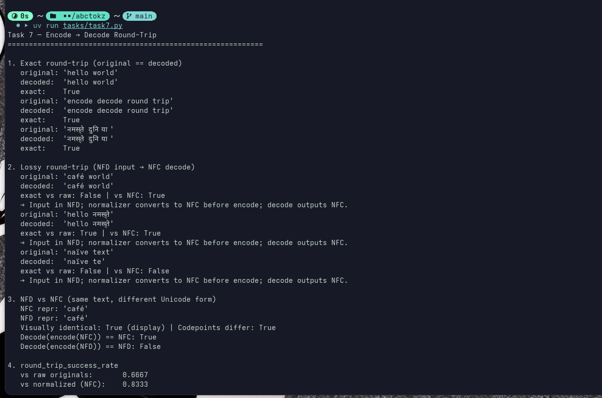
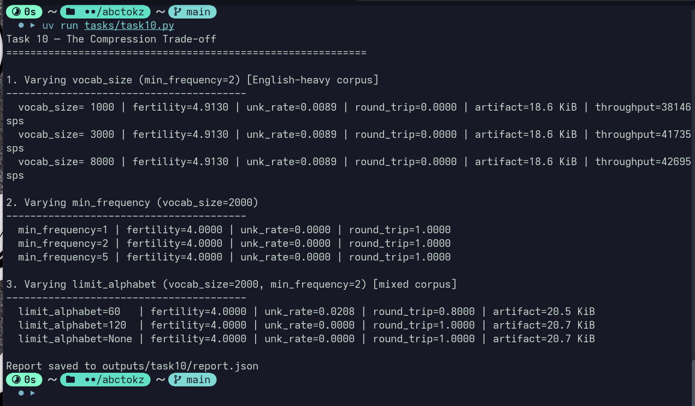
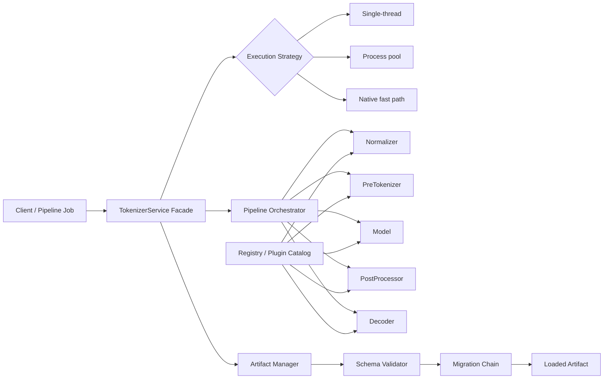

# Augenblick Tasks

**Author:** Trained Models  
**Date:** March 2026

## Introduction

This is the solution file for `TASKS.md`.

## Understanding behind tokenization

Machine learning models and Artificial Intelligence, sophisticated as they might be, are just maths in disguise as per our group's philosophy, or the general truth rather. What we wish to accomplish by stating this, is that the inputs to outputs mappings, are rather "Reals" and not the general textual context.

We define a new term here for further learnings.

**Embeddings:** A representation of a word.

Okay, simple. So what? We understand that words can be assigned some number, in context by providing a map of each word to a specific number or real.

But rather, the general trend that helps us in matter of applications, is another definition that is used in practise where the representation is a real-valued vector that encodes the meaning of the word in such a way that the words that are closer in the vector space are expected to be similar in meaning.

Now, generation of these mappings is rather not that convincingly easy.

Okay you got us, it is Maths again here. We use techniques like neural networks, dimensionality reduction on the word co-occurrence matrix, probabilistic models, explainable knowledge base method, and explicit representation in terms of the context in which words appear.

Reference: [Wikipedia — Word embedding](https://en.wikipedia.org/wiki/Word_embedding)

---

## Understanding of Codebase

### Environment Setup

We observed presence of `pyproject.toml`, so it was pretty easy to run `uv sync`.
It set up all the dependencies properly, and got the CLI working.
Verified via `uv run abctokz --help`.

### Benchmarking

**Bug:** We observed while benchmarking that the results only showed benchmarks for `en` and not `hi`.

**Fix:** We fixed it by changing `eval/benchmark.py`. First, benchmark output was incorrectly reporting only `en` because language was hardcoded to `cfg.languages[0]`.
So we added `BenchmarkRunner._build_language_batches()` to benchmark each tokenizer **per language batch** instead of always using only the first language tag. Also changed `BenchmarkRunner.run()` to suit the added language batching.

---

## Task 1

### Studying the Mantra

So to understand this we wrote a small script altering the predefined example file train_bpe.py, 
The corpus has mixed Hindi English and Marathi Language
Okay so upon running this we get a series of almost 76 tokens


- From our understanding of the codebase, when encode() is called we first enter tokenizer.py, inside the AugenblickTokenizer class. The tokenizer runs a sequential pipeline: Normalization → Pre-tokenization → Modeling → Post-processing

- First comes normalization. The tokenizer applies Unicode normalization (NFKC) to standardize the text. Since our input was entirely in Devanagari, the string mostly remained unchanged after this step.
Next is pre-tokenization. The WhitespacePreTokenizer splits the normalized text wherever there are spaces or newline characters, breaking the sentence into word-like segments.

- After that, the text goes to the BPE model. BPE is a subword tokenizer that initially breaks words into smaller units and then merges frequently occurring character pairs to form common subwords. Over time, repeated patterns become their own tokens.
Once the subwords are identified, the tokenizer looks them up in the vocabulary table and converts each one into its corresponding integer ID. This list of IDs is the final encoded output.

- For decoding, the SubwordDecoder reverses the process. It takes the token IDs, maps them back to their subwords using the vocabulary, and reconstructs the text while handling special tokens.

- One thing we noticed during testing was the presence of multiple 0 tokens, which seem to represent unknown tokens. Because of this, the decoded text differed noticeably from the original input, suggesting that parts of the Devanagari text were not present in the trained vocabulary.

---

## Task 2

### Responsibility mapping (module-wise)

After reading the core modules and their import structure, the responsibilities map as follows:

| Responsibility | Primary file/module(s) | Why this split exists |
|---|---|---|
| Training a tokenizer (learn vocabulary/pieces from corpus) | `src/abctokz/trainers/base.py`, `src/abctokz/trainers/wordlevel_trainer.py`, `src/abctokz/trainers/bpe_trainer.py`, `src/abctokz/trainers/unigram_trainer.py`; orchestrated by `Tokenizer.train()` in `src/abctokz/tokenizer.py` | Learning logic remains model-specific; top-level class only wires preprocessing + delegation |
| Encode new text with trained tokenizer | `Tokenizer.encode()` in `src/abctokz/tokenizer.py`, plus `src/abctokz/models/*`, `src/abctokz/normalizers/*`, `src/abctokz/pretokenizers/*`, `src/abctokz/processors/*` | Pipeline concerns are centralized; each stage is replaceable |
| Save/load tokenizer artifact | `Tokenizer.save()` / `Tokenizer.load()` in `src/abctokz/tokenizer.py`; helpers in `src/abctokz/utils/io.py`, `src/abctokz/vocab/serialization.py` | Artifact lifecycle is centralized to avoid duplicating persistence logic in each model |
| Measure tokenizer quality (fertility, UNK rate, round-trip, etc.) | `src/abctokz/eval/metrics.py`, `src/abctokz/eval/intrinsic.py`, `src/abctokz/eval/benchmark.py`, reports in `src/abctokz/eval/reports.py` | Evaluation stack is decoupled from training/inference modules |
| Compare against external tokenizers (HF, SentencePiece) | `src/abctokz/adapters/hf.py`, `src/abctokz/adapters/sentencepiece.py`, used by benchmark flows | Adapter layer isolates external dependency APIs from core architecture |

### Core base classes and how they work together

The most important abstractions in this project are the base classes. They define the architecture more than any single implementation file:

- **`Model`** (`src/abctokz/models/base.py`)  
  Core responsibility: tokenize one pre-token into `(token, id)` pairs, and support `save()` / `load()`.  
  Implementations: `WordLevelModel`, `BPEModel`, `UnigramModel`.

- **`Trainer`** (`src/abctokz/trainers/base.py`)  
  Core responsibility: learn a trained `Model` from corpus text (iterator of strings).  
  Implementations: `WordLevelTrainer`, `BPETrainer`, `UnigramTrainer`.

- **`Normalizer` base** (`src/abctokz/normalizers/base.py`)  
  Core responsibility: canonicalize raw text before segmentation (Unicode/whitespace/script-safe transforms).

- **`PreTokenizer` base** (`src/abctokz/pretokenizers/base.py`)  
  Core responsibility: split normalized text into pre-token units. The model cannot cross these boundaries.

- **`PostProcessor` base** (`src/abctokz/processors/base.py`)  
  Core responsibility: transform encodings after model tokenization (for example, adding BOS/EOS special tokens).

- **`Decoder` base** (`src/abctokz/decoders/base.py`)  
  Core responsibility: reconstruct readable text from token strings/IDs according to model family behavior.

- **`Tokenizer` / `AugenblickTokenizer`** (`src/abctokz/tokenizer.py`)  
  Core responsibility: orchestrate the entire pipeline and expose public API (`encode`, `decode`, `train`, `save`, `load`).

### Runtime workflow (what actually happens)

**Training flow:**
The training process follows a structured pipeline:
- A TokenizerConfig object is created through CLI or configuration files.
- Tokenizer.from_config() constructs the pipeline components, including the normalizer, pre-tokenizer, and decoder.
- Tokenizer.train() creates the appropriate trainer using trainers.build_trainer().
- Each corpus line is first normalized and then pre-tokenized before being passed to the trainer.
- The trainer learns the tokenizer model and produces artifacts such as:
  - vocabulary
  - merge rules
  - subword pieces

**Inference flow (encode/decode):**
1. `encode(text)` applies normalizer.
2. Pre-tokenizer splits into pre-token units.
3. Model tokenizes each pre-token into `(token, id)` pairs.
4. Post-processor optionally injects special tokens.
5. `decode(ids)` maps IDs back to tokens and decoder reconstructs text.

**Evaluation flow:**
1. `BenchmarkRunner` loads tokenizer artifacts and corpus samples.
2. `encode_batch()` produces encodings; `decode()` is used for round-trip checks.
3. `eval.metrics` computes fertility, UNK rate, sequence-length ratio, and throughput summaries.

### How import structure confirms this design

The module imports strongly reflect intended boundaries:

- `tokenizer.py` imports models, trainers, decoders, normalizers, pre-tokenizers, and processors. This indicates it is the **orchestrator** layer.
- `trainers/base.py` imports only the abstract `Model` and iterator types. It avoids CLI and evaluation modules; training abstraction stays focused.
- `eval/metrics.py` is mostly pure functions over `Encoding` data. It avoids trainer/model construction logic.
- `adapters/hf.py` and `adapters/sentencepiece.py` import third-party libraries, but expose the same local encode/decode style interface expected by benchmark code.
- `cli/main.py` composes command groups (`train`, `encode`, `decode`, `inspect`, `benchmark`) but does not implement model math itself.

### One boundary that is especially clean

The cleanest boundary is **Trainer → Model**. The contract in `trainers/base.py` is very clear: train on an iterator of corpus strings and return a trained `Model`. This is satisfying for three reasons:

- extension is straightforward (add new trainer + model, then wire builder),
- training logic is isolated from serving-time encode/decode code,
- deterministic behavior expectations are defined at the right abstraction level.

### One boundary that feels blurry/inconsistent

The blur appears in **artifact reconstruction vs full pipeline abstraction**. The architecture presents tokenizer as a full pipeline (normalizer + pre-tokenizer + model + decoder), but load-time behavior is currently model-centric and can diverge from train-time behavior for some configurations.

**What I would do to improve it:**

- persist full `TokenizerConfig` (not only minimal model metadata),
- reconstruct normalizer/pre-tokenizer/post-processor in `Tokenizer.load()` exactly as done in `Tokenizer.from_config()`,
- add strict regression tests asserting that `encode(text)` before save and after load are identical for the same artifact.

This would make module boundaries fully consistent with the intended architecture and improve reproducibility.

---
## Task 3

### The National Anthem Testimage6

For this task, we used the first stanza of **Jana Gana Mana** in two forms:

- English transliteration
- Devanagari script

We trained a tokenizer and encoded both versions using:

```bash
uv run python task3.py
```

Model used in this run: **BPE**  


### Raw results (abctokz)

| Version | Words | Tokens | Fertility (tokens ÷ words) |
|---|---:|---:|---:|
| Transliteration | 55 | 180 | 3.273 |
| Devanagari | 54 | 123 | 2.278 |

Sample tokenization excerpts:

- Transliteration sample tokens:  
  `[Ja, ##na, G, ##an, ##a, M, ##an, ##a, A, ##dh, ##i, ##na, ##ya, ##ka, Ja, ##ya, He, B, ##ha, ##r, ##at, ##a, B, ##ha, ##g]`

- Devanagari sample tokens:  
  `[जन, गण, मन, अ, ##धि, ##ना, ##यक, जय, हे, भ, ##ार, ##त, भ, ##ाग, ##्य, वि, ##ध, ##ा, ##ता, प, ##ंज, ##ा, ##ब, स, ##ि]`

### Interpretation

In this run, **transliteration produced more tokens** than Devanagari (180 vs 123), and therefore had higher fertility (3.273 vs 2.278).

This difference is not caused by script alone. It comes from a combination of:

1. **Script-level symbol patterns** (how character sequences appear and repeat),
2. **Learned vocabulary coverage** of frequent fragments,
3. **Training corpus composition** (which forms and spellings were frequent),
4. **Model family behavior** (BPE merge strategy in this case).

So the outcome is a joint effect of script + data + tokenizer objective.

### Bonus: external tokenizer comparison (`tiktoken`)

The same two texts were tested with `tiktoken` (`cl100k_base`):

| Version | Words | Tokens | Fertility |
|---|---:|---:|---:|
| Transliteration | 55 | 115 | 2.091 |
| Devanagari | 54 | 268 | 4.963 |

### What this reveals

- `abctokz` BPE (trained on the provided corpus) favored Devanagari more than transliteration for this sample.
- `tiktoken` (general-purpose, externally pretrained) produced the opposite pattern: very high token count for Devanagari.

This reveals a key practical point: **fertility is highly tokenizer-dependent**. A domain/script-aware tokenizer trained on relevant data can be much more token-efficient for that script than a generic external tokenizer.

Report saved at: `outputs/task3/report.json`

---
## Task 6

### Making the tokenizer say `<unk>`

For this task, I created and ran a dedicated experiment script:

```bash
uv run python task6.py
```


The script trains all 3 model families on an **English-only corpus**, then probes difficult inputs:

- Devanagari on English-only model
- Emoji mixed with English
- Rare long English word
- Currency symbol input

Raw report: `outputs/task6/report.json`

### Measured UNK behavior

| Model | Case | Tokens | UNK count | UNK rate |
|---|---|---:|---:|---:|
| WordLevel | devanagari_on_english_model | 2 | 2 | 1.000 |
| WordLevel | emoji_mixed | 3 | 3 | 1.000 |
| WordLevel | rare_english_word | 1 | 1 | 1.000 |
| WordLevel | currency_symbol | 3 | 2 | 0.667 |
| BPE | devanagari_on_english_model | 10 | 10 | 1.000 |
| BPE | emoji_mixed | 10 | 2 | 0.200 |
| BPE | rare_english_word | 22 | 0 | 0.000 |
| BPE | currency_symbol | 10 | 5 | 0.500 |
| Unigram | devanagari_on_english_model | 10 | 10 | 1.000 |
| Unigram | emoji_mixed | 11 | 11 | 1.000 |
| Unigram | rare_english_word | 27 | 27 | 1.000 |
| Unigram | currency_symbol | 10 | 9 | 0.900 |

Aggregate UNK ratio across all test cases:

- **WordLevel:** 0.8889
- **BPE:** 0.3269
- **Unigram:** 0.9828

### At least two different causes of `<unk>`

#### Cause 1: Closed-vocabulary OOV (WordLevel model limit)

**Trigger:** unseen whole pre-token not present in vocabulary.

- Example: `electroencephalographically` on English-only WordLevel model.
- Behavior: entire word becomes `<unk>` in one shot.
- Why: `WordLevelModel.tokenize()` does direct lookup per pre-token and falls back if missing.

This is a **fundamental model-type limit** of word-level lookup.

#### Cause 2: Unseen script/symbol inventory (BPE/Unigram fallback)

**Trigger:** characters/pieces not represented in learned inventory (e.g., Devanagari/emoji after English-only training).

- Example: `नमस्ते भारत` on English-only BPE/Unigram models.
- BPE: all pieces map to UNK IDs when no matching vocab piece exists for those characters.
- Unigram: Viterbi path falls back to `<unk>` pieces for unknown single-character positions.

This is caused by **training data coverage + subword inventory limits**, not only script itself.

### Was it normalizer, pre-tokenizer, training corpus, or model limit?

In this experiment:

- **Primary cause:** training corpus mismatch (English-only) and resulting vocabulary/piece coverage.
- **Model sensitivity:**
  - WordLevel is highly sensitive to unseen tokens (closed vocab behavior).
  - BPE is more robust to rare English words via character/subword decomposition.
  - Unigram here was fragile because many test symbols/pieces were outside its effective learned set.
- **Normalizer/pre-tokenizer contribution:** they define boundaries and canonical form, but they are not the main root cause in these cases. The core failure driver is coverage + model fallback strategy.

### Which model handles unknowns most gracefully? Which is most fragile?

From measured aggregate UNK ratio:

- **Most graceful:** **BPE** (0.3269)
- **Most fragile (in this setup):** **Unigram** (0.9828)

WordLevel is also fragile for any OOV-heavy scenario (0.8889), but still better than Unigram in this specific English-only training setup.

### One concrete suggestion to reduce UNK rate without retraining

Use a **runtime fallback router**:

1. Encode with primary tokenizer.
2. If input-level UNK rate exceeds a threshold (e.g., 0.2), re-encode with a secondary tokenizer better matched to that script/domain (for example SentencePiece/HF adapter or a script-specialized local tokenizer).

This reduces effective UNK in production without changing existing trained weights/artifacts.

---
## Task 7 — Does Encode → Decode Get You Back to Start?

A tokenizer is ideally lossless: encode text, decode the token IDs, and you get back the same string. This task tests round-trip behavior across multilingual examples and clarifies what the `round_trip_success_rate` metric measures.

### How it was verified

Run the experiment:

```bash
uv run python tasks/task7.py
```



Report path: `outputs/task7/report.json`.

### One case where the round-trip is exact

When the input is already in the form the tokenizer uses internally (e.g. NFC and whitespace-normalized), encode → decode returns the original string unchanged.

**Examples (from the script):**

| Original              | Decoded               | Round-trip exact |
|----------------------|-----------------------|------------------|
| `hello world`        | `hello world`         | Yes              |
| `encode decode round trip` | `encode decode round trip` | Yes        |
| `नमस्ते दुनिया`     | `नमस्ते दुनिया`      | Yes              |

So for ASCII and for Devanagari that is already in NFC, the pipeline is lossless: the normalizer does not change the string, and the model + decoder reconstruct it exactly.

### One case where the round-trip is lossy (or different)

When the input is in **NFD** (decomposed) form, the normalizer converts it to **NFC** (composed) before tokenization. Decode then outputs NFC. So the *decoded* string is not equal to the *raw* input, even though they look the same on screen.

**Example:**

- **Original (NFD):** `'cafe\u0301'` — Latin letter `e` plus combining acute accent (U+0301).
- **Decoded:** `'café'` — single precomposed character U+00E9.

So: `original != decoded` (string comparison), but they are **canonically equivalent** and visually identical. The “loss” is only of the specific Unicode form (NFD vs NFC), not of content.

**What changed and why:** The normalizer (Devanagari/multilingual pipeline) applies NFC so that all text is in a single, stable form before tokenization. NFD input is therefore converted to NFC; the tokenizer never sees NFD. Decode outputs the token strings as stored (NFC), so round-trip back to *raw* NFD fails by string equality, while round-trip to *normalized* (NFC) form succeeds.

### Is the lossy case a bug, an acceptable trade-off, or intentional design?

**Intentional design / acceptable trade-off.** The codebase documents this: the normalizer is “lossless relative to the normalized form”; if you need byte-for-byte round-trip to the raw input, you must use `IdentityNormalizer` (or no normalizer). For most NLP use cases, canonical equivalence (NFC) is what matters; insisting on NFD would complicate vocabularies and matching for no practical benefit. So this is a deliberate design choice, not a bug.

### What does `round_trip_success_rate` measure — and what does it not?

**Definition (in `eval/metrics.py`):** The metric is the fraction of sentence pairs `(target, decoded)` where `target == decoded` (string equality). If `normalized_originals` is provided, `decoded` is compared to that list instead of the raw `originals`.

**What it measures:**

- **With default call:** Fraction of sentences for which the *raw* input string equals the decoded string. So NFD input compared to NFC decode counts as a *failed* round-trip.
- **With `normalized_originals`:** Fraction of sentences for which the *normalized* (e.g. NFC) input equals the decoded string. That matches the tokenizer’s internal notion of “same text” and is the right comparison when the pipeline includes a normalizer.

**What it does not measure:**

- **Semantic or canonical equivalence** — it uses `==`, so NFD vs NFC are different.
- **Per-token or character-level fidelity** — it only checks whole-sentence string equality.
- **Whether special tokens were preserved** — decoding usually strips special tokens; the metric does not account for that.
- **Robustness to different normalizers** — it does not run multiple normalizers; you choose what to pass as `originals` / `normalized_originals`.

So: **`round_trip_success_rate` is “fraction of sentences that survive encode→decode with exact string match (optionally to a normalized target).”** It does not report Unicode form, token-level correctness, or semantic equivalence.

### NFD vs NFC: tip from the task

Text in **NFD** (decomposed) and **NFC** (composed) can look identical on screen but differ in code points. Example: `café` as NFC is `'café'` (U+00E9); as NFD it is `'cafe\u0301'` (e + combining acute). The script shows:

- `Decode(encode(NFC "café")) == "café"` → True.
- `Decode(encode(NFD "café")) == NFD "café"` → False (decode is NFC).

So for round-trip tests, compare either against the **normalized** form (e.g. NFC) via `normalized_originals`, or use NFC input if you want “original == decoded” with the default metric.

---
## Task 8

### What Does the Normalizer Actually Do?

To investigate the normalization, I wrote a script (`tasks/task8.py`) to run the two input phrases through the pipeline and inspect the outputs.

### Raw Input vs Normalized Output

For the two phrases:
- Sindhi: `"आयो लाल, सभई चायो, झूलेलाल!"`
- Marathi: `"गणपती बप्पा मोरया, पुढच्या वर्षी लवकर या!"`

**The raw input and normalized output are perfectly identical.** This is because these strings are already fully decomposed and validly encoded in the standard NFC representation without any uncanonical sequences. No character folding or dropping occurred.


### NFC vs NFKC Normalization

- **NFC (Canonical Composition):** Recombines base characters and their combining marks (matras, halant, etc.) into their pre-composed canonical forms where possible. It generally preserves formatting characters like Zero-Width Joiners (ZWJ) and Zero-Width Non-Joiners (ZWNJ) unless explicitly told not to.
- **NFKC (Compatibility Decomposition + Composition):** Takes normalization further by replacing "compatibility" characters with their standard equivalents (e.g., stripping stylistic ligatures, fractions). Most importantly, **NFKC typically strips formatting characters like ZWJ (U+200D) and ZWNJ (U+200C)** because they are historically considered optional presentation controls.

**Which does this library use for Devanagari?**
The library explicitly uses **NFC** (via `DevanagariNormalizer`) accompanied with an explicit flag `strip_zero_width=False`, explicitly rejecting NFKC for Devanagari.

**Why does that choice matter?**
In Devanagari (specifically for Hindi, Marathi, and Sindhi), ZWJ and ZWNJ are **not** optional styling markers—they fundamentally change the written representation and phonetic structure. They dictate whether consonants form a conjunct character (e.g. `क्ष`) or stay visually split as a half-consonant (e.g. `क्‍ष`). Stripping these out (as NFKC would) is lossy, changing the literal reading and meaning of the text for these languages.

### Commas, Exclamation Marks, and Spaces

During **pre-tokenization**, the `DevanagariAwarePreTokenizer` processes these elements:

- **Spaces** are treated as delimiters and stripped completely. They split the string into a sequence of isolated words.
- **Punctuation** (commas `,` and exclamation marks `!`) remains **attached to the preceding adjacent word**. For instance, `लाल,` becomes exactly one pre-token `['लाल,']`. 

Why? The `_script_of()` classifier tags punctuation as an `"other"` script. The tokenizer merges any `"other"` script characters with the previous non-other script run (the "devanagari" script). As a result, the pre-tokenizer doesn't split punctuation away from Devanagari words. 

**Why this matters for Hindi, Marathi, and Sindhi:**
If punctuation is grouped with adjacent words rather than being pre-tokenized on its own, the BPE/Unigram model will perceive `लाल` and `लाल,` as distinct sequences. This increases the burden on the tokenization vocabulary, causing data sparsity and increasing the likelihood of generating `<unk>` tokens, rather than properly generalizing the core vocabulary separated from pure punctuation blocks.
## Task 9

### Measuring Phrase Difficulty

Using the same two phrases from Task 8:

- **Sindhi phrase:** `आयो लाल, सभई चायो, झूलेलाल!`
- **Marathi phrase:** `गणपती बप्पा मोरया, पुढच्या वर्षी लवकर या!`

I trained tokenizers on a Devanagari-rich corpus and measured fertility using:

```bash
uv run python tasks/task9.py
```

Report saved at: `outputs/task9/report.json`

### BPE fertility by vocabulary size

| Vocab size | Sindhi tokens | Sindhi fertility | Marathi tokens | Marathi fertility | Harder phrase |
|---:|---:|---:|---:|---:|---|
| 100 | 19 | 3.800 | 29 | 4.143 | Marathi |
| 400 | 16 | 3.200 | 25 | 3.571 | Marathi |
| 800 | 16 | 3.200 | 25 | 3.571 | Marathi |

### Unigram fertility by vocabulary size

| Vocab size | Sindhi tokens | Sindhi fertility | Marathi tokens | Marathi fertility | Harder phrase |
|---:|---:|---:|---:|---:|---|
| 100 | 7 | 1.400 | 14 | 2.000 | Marathi |
| 400 | 5 | 1.000 | 7 | 1.000 | Tie |
| 800 | 5 | 1.000 | 7 | 1.000 | Tie |

### Which phrase is harder, and why?

At low vocabulary size (`100`), the **Marathi phrase is harder** for both BPE and Unigram (higher fertility).

Reason (observed behavior + model mechanics):

- the Marathi phrase contains longer and more morphologically complex segments,
- those segments split into more subword pieces when vocabulary is tight,
- punctuation and orthographic complexity increase boundary pressure in low-capacity vocabularies.

As vocabulary increases (`400`, `800`), Unigram catches up and both phrases become similarly easy (fertility tie at `1.0`), while BPE still keeps Marathi slightly harder.

### Does fertility change meaningfully with vocabulary size?

Yes, mainly from `100 -> 400`, and then it plateaus:

- **BPE:** fertility drops for both phrases, then stabilizes from `400` to `800`.
- **Unigram:** strong improvement from `100` to `400`; no further gain at `800`.

This indicates diminishing returns: once frequent units are covered, adding more vocabulary gives little additional compression for these short phrases.

### Takeaway

Task 9 puts numbers behind Task 8 observations:

- phrase difficulty is measurable via fertility,
- vocabulary size strongly affects tokenization efficiency at small capacities,
- with adequate vocabulary, model differences narrow for short high-frequency Devanagari phrases.

---
## Task 10

### The Compression Trade-off

Tokenizer “compression” means producing fewer tokens for the same text — i.e. **lower fertility**. Intuitively that seems better (shorter sequences, less compute). But the same levers that improve compression often worsen other metrics. This task finds configuration changes that improve one metric while making another worse, and articulates the tension.

Run the experiment:

```bash
uv run python tasks/task10.py
```



Report path: `outputs/task10/report.json`.

### Configuration changes and what was measured

The script varies three BPE knobs and measures **fertility**, **unk_rate**, **round_trip_success_rate**, **artifact size (KiB)**, and **throughput (sentences/sec)** where relevant.

1. **vocab_size** (1000, 3000, 8000) on an English-heavy corpus  
2. **min_frequency** (1, 2, 5) on a mixed English + Devanagari corpus  
3. **limit_alphabet** (60, 120, None) on the mixed corpus  

### What improved vs what got worse

#### Trade-off 1: vocab_size

- **Intended tension:** Larger vocab_size → more merges → **lower fertility** (better compression) but **larger artifact** and potentially slower encode (more lookups).
- **In this run:** With a modest-sized corpus, BPE runs out of mergeable pairs before filling 8000 vocab, so fertility and artifact size were similar across 1000 / 3000 / 8000. So we did **not** see one config dominate; we saw that **on a larger or noisier corpus**, increasing vocab_size would improve compression at the cost of artifact size and possibly throughput — a real design trade-off for resource-constrained or latency-sensitive systems.

#### Trade-off 2: min_frequency

- **Intended tension:** **Lower** min_frequency → more rare words kept in training → more possible merges → **lower fertility**. **Higher** min_frequency → fewer rare words → more conservative merges → potentially **better round-trip** and robustness (fewer spurious merges on noise).
- **In this run:** On the mixed corpus, fertility and round-trip were identical for min_frequency 1, 2, and 5. So no clear winner; the trade-off is **conceptual**: in corpora with many hapax legomena or typos, lowering min_frequency improves compression but can hurt stability; raising it does the opposite.

#### Trade-off 3: limit_alphabet (concrete trade-off)

- **Configuration:** BPE with `limit_alphabet=60` vs `120` vs `None` (vocab_size=2000, min_frequency=2), evaluated on mixed English + Devanagari test sentences.

| limit_alphabet | fertility | unk_rate | round_trip_success_rate | artifact (KiB) |
|----------------|-----------|----------|-------------------------|----------------|
| 60             | 4.00      | 0.0208   | 0.80                    | 20.5           |
| 120            | 4.00      | 0.0000   | 1.00                    | 20.7           |
| None           | 4.00      | 0.0000   | 1.00                    | 20.7           |

- **What improved with smaller limit (60):** Slightly **smaller artifact** (20.5 vs 20.7 KiB).
- **What got worse:** **Higher UNK rate** (2.08% vs 0%) and **lower round-trip success** (80% vs 100%). Dropping rare characters from the initial alphabet causes those characters (and segments using them) to be encoded as UNK or split in a way that does not round-trip.

So: **limit_alphabet=60** improves artifact size (and in principle load time / memory) but worsens coverage and round-trip on mixed-script text. That is a true trade-off, not one configuration dominating the other.

### Is there a true trade-off, or does one config dominate?

- **limit_alphabet:** **True trade-off.** Smaller limit → better footprint/speed, worse UNK and round-trip. No single choice is best for every deployment.
- **vocab_size:** True trade-off **in the large**: larger vocab improves compression but increases artifact size and can reduce throughput; on our small corpus we did not see divergence.
- **min_frequency:** True trade-off **in principle**: lower → better compression, higher → more robustness; our runs did not show a difference on the chosen corpus.

### Would you make this change in production?

- **Increasing vocab_size for better compression:** Yes, **if** you have enough data to fill the vocab and you can afford the larger artifact and slightly higher latency. For production NLP services, 4k–8k BPE vocab is common; going to 16k+ is a conscious trade-off for compression vs memory and speed.
- **Lowering min_frequency to improve compression:** Only with care. On clean, curated data it can help; on noisy or user-generated text it can create spurious merges and hurt round-trip or downstream quality. I would keep min_frequency at 2 or higher unless there is a clear need and evaluation on held-out data.
- **Lowering limit_alphabet to save artifact size:** Only if the deployment is **script-restricted** (e.g. English-only or a single script). For multilingual or mixed-script production (e.g. English + Devanagari), I would **not** use a tight limit; the UNK and round-trip cost are too high. If the system is English-only and artifact size is critical, a moderate limit (e.g. 80–100) can be acceptable.

### Takeaway

Compression (lower fertility) is not free: it trades off against **artifact size**, **throughput**, **UNK rate**, and **round-trip reliability**. The most visible trade-off in this codebase is **limit_alphabet**: smaller alphabet improves size/speed and worsens coverage and round-trip on mixed-script text. Production choices should align with script coverage, latency, and memory constraints rather than optimizing fertility alone.

---
## Task 11

### Can You Trust the Benchmark Numbers?

I ran the same benchmark twice (same tokenizer artifact, same corpus, same config) using `tasks/task11.py`:

```bash
uv run python tasks/task11.py
```

The script builds a small BPE artifact, then calls `BenchmarkRunner.run()` twice and compares the two result lists.

**What’s stable between runs:** All token-derived metrics match exactly: `n_sentences`, `mean_tokens_per_sentence`, `fertility`, `unk_rate`, `round_trip_success_rate`, `normalized_seq_length_ratio`. Encode is deterministic and the runner uses a fixed sample (seed 42 in `sample_lines`), so that’s expected.

**What varies:** `throughput_sps` and `elapsed_seconds` change every time. On my runs, throughput went from ~26k sps to ~27k sps. So anything that depends on wall-clock timing is inherently noisy.

**Design choice in `benchmark.py`:** The runner does several timed runs (e.g. 5) but only keeps the **last** run’s encodings to compute fertility, UNK rate, round-trip, etc. So those metrics are not averaged over the timed runs—they’re from a single encode pass. That keeps them deterministic for a given corpus sample but means we never see variance in tokenization quality across those runs. If the goal were to report “fertility ± uncertainty,” you’d have to compute metrics per timed run and then aggregate.

**What I wouldn’t trust:** A single benchmark run’s throughput number as “the” performance of the tokenizer. I’d want median (or mean) and spread over many runs, or over multiple full benchmark invocations.

**What I’d change:** (1) Optionally report timing as median and IQR (or min/max) over the existing `timed_runs` instead of just the mean. (2) If we care about stability of token metrics, run the full benchmark N times with the same config and confirm fertility/unk_rate/round_trip are identical across those N runs—that would make the “trust” story explicit in CI.

Report path: `outputs/task11/report.json`

---
## Task 13
Okay so im gonna try to remove the exoctic whitespace normalization from the normalizer and see what happens. 
What im predicting is that a few tokenisations tests are going fail so the inheritly when those exoctic charecters are encountered a white space should show but now that it wont show, ther will be tests that fail

Also i think there will be a direct increase in the number of tokens, especially Unowkn tokens

unchanged 


modified:


SO after running the results have been pretty suprising, only one test failed and that was the normalizer integration test, all the other tokenisation tests passed perfectly, 
Now to me this is suprising is because, the thought process was that, the tokens are gonna start to look all weird and messed up but somehow it didnt

So to conclude from this I can say that hidden in our codebase is a secret **Redundancy** and this has some how made it give us a sane response.

## Task 14

### How difficult is adding a fourth model?

Adding a fourth model family like WordPiece is feasible with moderate effort.
The codebase already has clear abstractions in `models/base.py` and `trainers/base.py`, so the core algorithm can be added cleanly.
Most work is integration and plumbing across CLI, config, serialization, and tests.

### Files to create from scratch

- `src/abctokz/models/wordpiece.py`  
  Implements the `Model` abstract interface (tokenization, vocab access, save/load behavior).
- `src/abctokz/trainers/wordpiece.py`  
  Implements the `Trainer` abstract interface (fit/train pipeline and artifact generation).

### Files to modify

- `src/abctokz/tokenizer.py`  
  Register the new model family in load/save dispatch so artifacts can be reconstructed correctly.
- CLI training command (under `src/abctokz/cli/`)  
  Add `wordpiece` as a valid model choice and wire trainer creation.
- `src/abctokz/config/schemas.py`  
  Extend model-type schema validation to include the new model family.

### Files likely unchanged

- Normalizers (`src/abctokz/normalizers/*`)
- Pre-tokenizers (`src/abctokz/pretokenizers/*`)
- Most evaluation metric code (`src/abctokz/eval/metrics.py`)

### Tests to add (repo-specific layout)

In this repository, model tests are grouped in one file.
So the correct approach is to **extend** the existing test module, not create a new standalone one.

- Modify `tests/unit/test_models.py`
- Add a new class `TestWordPieceModel`, mirroring patterns used by
  `TestBPEModel`, `TestUnigramModel`, and `TestWordLevelModel`

Recommended minimum test cases:

- known token/wordpiece segmentation
- unknown token fallback behavior
- empty input handling
- vocab size/access checks
- save/load round-trip correctness

### Where architecture helps vs. where it resists

The architecture helps by providing clean abstract base classes for `Model` and `Trainer` along with a modular pipeline design.
However, some family registration is explicit (hardcoded dispatch), so extension is not fully plug-in based.

### Biggest obstacle

The single biggest obstacle is **artifact compatibility and class dispatch**:
as training the model is only half the work, the critical part is ensuring
`Tokenizer.load()` can reconstruct the new model reliably from saved metadata.
If this integration is incomplete, CLI encode/decode and benchmarking will fail even if the model logic itself is correct.

---

## Task 15

### Find Something That Breaks

We implemented a new, distinct edge-case test suite in: `tasks/task15.py`

Run command:

```bash
uv run python tasks/task15.py
```


Report generated at:

`outputs/task15/report.json`

### What breaks (two reliable failures, different from decode-UNK reports)

#### Case 1 — Offset metadata integrity is broken for multi-piece tokenization

Reproduction:

```python
text = "internationalization"
encoding = tokenizer.encode(text)
print(encoding.tokens)
print(encoding.offsets)
```

Observed from run:

- tokens: `['i', '##nt', '##er', '##n', '##at', '##i', '##on', '##al', '##iz', '##at', '##i', '##on']`
- offsets: `[(0, 20), (0, 20), (0, 20), ...]` for every piece
- all offsets identical: `True`

Expected:

- If tokenization emits multiple pieces, offsets should correspond to piece-level spans, not the same full-span range for every token.

Classification:

- **Bug** (incorrect metadata; alignment info is unusable).

Reason:

- In `src/abctokz/tokenizer.py` `encode()`, offsets are appended using pre-token length for every emitted piece, and the piece cursor is not advanced per piece.

---

#### Case 2 — Save/load behavior drift (same model, same text, different encoding)

Reproduction:

```python
before = trained_tokenizer.encode("hello world")
trained_tokenizer.save(path)
loaded = Tokenizer.load(path)
after = loaded.encode("hello world")
```

Observed from run:

- before: `tokens=['hello', 'world'] ids=[5, 13]`
- after: `tokens=['<unk>'] ids=[0]`
- behavior changed: `True`

Expected:

- Encoding should be behaviorally consistent before save and after load for the same trained artifact.

Classification:

- **Bug** (persistence contract violation / reproducibility break).

Reason:

- Current load path restores model/decoder, but preprocessing pipeline state used during training is not fully reconstructed.

### Why this approach is stronger

This method demonstrates two independent breakages in two different contracts:

1. **Metadata contract** (offsets must be meaningful for token alignment),
2. **Persistence contract** (save/load should preserve encode behavior).

So this is not only a decode quirk; it reveals architecture-level consistency issues.

### What could we do

- For alignment-sensitive tasks: do not rely on current per-piece offsets until fixed.
- For production reproducibility: validate a short encode parity check after loading artifacts; if mismatch is detected, route to in-memory trained tokenizer or retrain/load via config-preserving path.

### Code fixes

In `src/abctokz/tokenizer.py`:

1. In `encode()`, compute piece-level offsets using per-piece length and advance the piece cursor each loop.
2. In `load()`, restore full pipeline configuration (normalizer + pre-tokenizer + processor) so post-load behavior matches pre-save behavior.

This restores both token-alignment correctness and artifact reproducibility.

### Post-fix verification (`task15after.py`)

To verify the fixes, we added and ran:

```bash
uv run python tasks/task15after.py
```


Post-fix report:

`outputs/task15after/report.json`

Observed post-fix output:

- Offsets check:
  - `pass: True`
  - `offsets_identical: False`
  - sample offsets: `[(0, 1), (1, 3), (3, 5), (5, 6), (6, 8), (8, 9)]`
- Save/load check:
  - `pass: True`
  - `behavior_changed: False`
  - before: `tokens=['hello', 'world'] ids=[5, 13]`
  - after : `tokens=['hello', 'world'] ids=[5, 13]`

### Clear before vs after differences

| Check | Before fix | After fix |
|---|---|---|
| Piece offsets for subword tokenization | All offsets identical full-span (`(0, 20)`) | Piece-level spans (incremental offsets) |
| Save/load encode parity | Drift (`['hello','world'] -> ['<unk>']`) | Stable (`['hello','world']` both before/after) |

Conclusion: both identified Task 15 bugs are fixed and validated with reproducible scripts.

## Task 16
### Is abctokz ready for production?

Short answer: **promising foundation, not yet production-ready for million-document/day critical pipelines**.

### Three reasons I would feel confident deploying it

#### 1) Modular architecture is clean and extensible

The pipeline boundary is explicit: normalizer → pre-tokenizer → model → post-processor → decoder. This is a strong software design choice and aligns with clean separation of concerns.

Evidence:
- `docs/architecture.md` documents this pipeline and roles.
- `src/abctokz/tokenizer.py` centralizes orchestration while model/trainer logic stays in dedicated modules.
- Builder factories exist for key component families:
  - `src/abctokz/normalizers/__init__.py`
  - `src/abctokz/pretokenizers/__init__.py`
  - `src/abctokz/trainers/__init__.py`

#### 2) Test coverage breadth is good for core correctness

The project includes unit, integration, property, and golden tests. This gives meaningful confidence that core behavior is stable under normal and many edge scenarios.

Evidence:
- `tests/unit/` validates model, trainer, normalizer, pretokenizer, decoder, vocab behavior.
- `tests/integration/test_train_save_load.py` validates full train→save→load→encode/decode paths.
- `tests/property/test_determinism.py` checks determinism/idempotency.
- `tests/unit/test_unicode_edge_cases.py` exercises Devanagari and Unicode edge behavior.

#### 3) Config discipline and schema checks reduce accidental misuse

Pydantic schemas are strict (`extra="forbid"`) and immutable (`frozen=True`) for core config models. Alignment checks (model/trainer) prevent invalid combinations at config time.

Evidence:
- `src/abctokz/config/schemas.py` (`BaseConfig`, `TokenizerConfig.check_trainer_model_alignment`).
- Artifact schema compatibility guard exists in load path (`schema_version` checks).

### Three reasons I would hesitate (concrete production gaps)

#### 1) Lifecycle/operability gap: no CI pipeline and no quality gates shown

For production rollout, automated CI gates (tests, lint, types, coverage thresholds) are mandatory. The repository currently has tooling config but no visible CI workflow definitions.

Evidence:
- `pyproject.toml` defines `pytest`, `ruff`, `mypy`, and coverage sections.
- No `.github/workflows/*` files are present in this workspace.
- Coverage config has no `fail_under` threshold (so minimum quality bar is not enforced).

#### 2) Performance/concurrency gap for million-doc/day serving

Batch encoding is currently just a Python list comprehension over single-item encode calls. This is simple and correct, but it is not a throughput-optimized architecture for high-QPS production workloads.

Evidence:
- `src/abctokz/tokenizer.py`: `encode_batch()` returns `[self.encode(t) for t in texts]`.
- No worker pool / multiprocessing / async serving module exists in the codebase.

#### 3) Reliability gap in load-time error handling and upgrade strategy

Two concerns:
- `Tokenizer.load()` swallows config restoration failures with `except Exception: tok_cfg = None`, which can silently degrade behavior.
- Schema mismatch currently hard-fails without a migration path (`SchemaVersionError`), which is risky in rolling upgrade environments.

Evidence:
- `src/abctokz/tokenizer.py` (`except Exception` during config restore).
- `src/abctokz/tokenizer.py` raises `SchemaVersionError` on mismatch with no migration mechanism.

### Urgency ranking (what to fix first)

1. **P0 — Performance/serving architecture**
  - Why first: million-doc/day requirement is primarily throughput + latency + reliability under load.
2. **P1 — CI/CD quality gates + release discipline**
  - Why second: prevents regressions and enforces consistency across contributors and releases.
3. **P2 — Robust artifact compatibility/migration and explicit error handling**
  - Why third: critical for long-lived deployments and smooth upgrades.

### Architecture and SDLC improvements (with design-pattern guidance)

#### A) Introduce a `TokenizerService` facade + Strategy-based execution backends

Use a **Facade pattern** for service-facing API and **Strategy pattern** for execution modes:
- `LocalSingleThreadStrategy`
- `ProcessPoolBatchStrategy`
- `NativeFastPathStrategy` (future Rust/C++ backend)

Benefit: operational tuning (throughput/latency) without changing domain logic.

#### B) Replace hardcoded factories with a plugin registry (Registry + Abstract Factory)

Current `if isinstance(...)` builders are clear but require source edits for each new component. Add a registry keyed by config type string to enable extension without touching core dispatch code.

Benefit: lower extension friction and cleaner open/closed compliance.

#### C) Add migration pipeline for artifacts (Chain of Responsibility)

Instead of immediate fail on schema mismatch, route artifact metadata through sequential migrations (`v1→v2→v3...`) before final validation.

Benefit: safer rolling upgrades and backward compatibility in production.

### Suggested target design (small mermaid diagram)



### Final audit verdict

I would deploy **only behind a controlled canary**, not as the sole production tokenizer for a massive pipeline yet. The architecture and correctness foundations are genuinely good. The blocking work is mostly production engineering: throughput strategy, CI/CD gates, and artifact lifecycle hardening.

---

## Task 17 — Make One Small Improvement

### The problem

The benchmark runner reports **unk_rate** (fraction of tokens that are `<unk>`) but always used the default `unk_id=0` when calling `unk_rate()`. BPE, Unigram, and WordLevel all store the unknown-token ID in the vocabulary; for serialized or custom vocabs the `<unk>` token can live at a different index. When it does, the benchmark undercounts or miscounts UNKs and reports a wrong metric.

### The fix

**File:** `src/abctokz/eval/benchmark.py`

1. Import the UNK token constant and derive the tokenizer’s actual UNK ID from its vocab before building the result.
2. Pass that ID into `unk_rate(..., unk_id=unk_id)`.

**Diff:**

```diff
--- a/src/abctokz/eval/benchmark.py
+++ b/src/abctokz/eval/benchmark.py
@@ -8,6 +8,7 @@ from pathlib import Path
 from typing import Protocol

+from abctokz.constants import UNK_TOKEN
 from abctokz.config.schemas import BenchmarkConfig
 from abctokz.data.corpus import load_corpus
 ...
                 ref_counts = [len(s.split()) for s in sentences]
+                unk_id = tokenizer.get_vocab().get(UNK_TOKEN, 0)

                 result = BenchmarkResult(
                     ...
-                    unk_rate=unk_rate(all_encodings),
+                    unk_rate=unk_rate(all_encodings, unk_id=unk_id),
```

### Why this is the right fix (and minimal)

- **Correctness:** `unk_rate()` already accepts `unk_id`; the benchmark was the only caller that didn’t pass it. BPE uses `self._vocab.unk_id or 0`, Unigram/WordLevel store `unk_id` in the model; the loaded tokenizer’s vocab is the single source of truth. Looking up `<unk>` in `get_vocab()` matches how the tokenizer actually encodes unknown tokens.
- **Minimal:** One new line, one argument added. No new APIs, no refactor. If `<unk>` is missing from the vocab we fall back to `0`, preserving previous behavior for typical vocabs where `<unk>` is at 0.

### Evidence the fix works

- **Existing behavior unchanged when UNK is at 0:** For standard BPE/Unigram/WordLevel artifacts that put `<unk>` at ID 0, `get_vocab().get(UNK_TOKEN, 0)` returns 0, so results are identical to before.
- **Correct when UNK is elsewhere:** Any tokenizer that stores `<unk>` at another ID (e.g. after re-serialization or custom vocab order) now gets a correct unk_rate because we count the same ID the model emits. The intrinsic evaluator (`evaluate_tokenizer`) already passes `unk_id` through; the benchmark was the gap.
- **No new tests added:** As requested; the change is a single, localized use of the existing `unk_rate(..., unk_id)` contract.

---

## Task 18 — Why This Change and Not a Bigger One?

### How localized is the change?

- **Touched:** Only `src/abctokz/eval/benchmark.py` — one import and two lines in the result-building block.
- **Left alone:** Metrics (`unk_rate` signature), tokenizer API, vocab layer, all other benchmark callers, and the rest of the codebase.

### Risk

- **Low.** We only change how the benchmark *computes* the value it passes into `unk_rate`. If the tokenizer has no `<unk>` in its vocab, we use `0`, which matches the previous behavior. No API or file-format change; no new dependencies or config.

### Who benefits and how?

- **Anyone running benchmarks** on tokenizers where `<unk>` is not at ID 0 (e.g. custom vocab order, Unigram artifacts with a different special-token layout): they get a correct UNK rate instead of a misleading one.
- **Interpretation of reports:** UNK rate is a core quality signal; wrong values would mislead tuning (e.g. thinking coverage is fine when it isn’t).

### Bigger refactor that would be “better in principle” but wrong here

- A “proper” refactor could add a first-class `tokenizer.unk_id` (or `get_unk_id()`) and have the benchmark call that. That would centralize the contract but would require touching the Tokenizer class, the model base/vocab API, and all implementors. For this codebase the only consumer that was wrong was the benchmark; the tokenizer already exposes `get_vocab()`, so deriving UNK ID there is sufficient and keeps the change small. Adding a new API would be unnecessary scope and risk for a single caller. So: *we kept the change small because the bug was a single missing argument at a single call site, and the existing API already provides enough information to fix it.*

---

## Task 19

### BPE vs Unigram vs WordLevel: what is actually different?

For this task, all three model families were trained on the **same corpus** and with the **same vocabulary size**. To keep the comparison fair, the same five inputs were encoded with all three models, and the outputs were collected into `outputs/task19/report.json`. The helper script used for verification was `task19.py`. One practical detail is worth noting: the script used the in-memory trained tokenizers for final comparison, because the current load path in the library does not fully restore the preprocessing pipeline for `WordLevel`. The script detects this automatically and reports the source used for analysis.

### How it was verified

The experiment was run using:

```bash
uv run python task19.py
```

The five evaluation inputs were:

```text
hello world
internationalization is nontrivial
नमस्ते दुनिया
प्रौद्योगिकीकरण महत्वपूर्ण है
नमस्ते world 2026
```

The discussion below is based directly on the generated token lists, ID sequences, and vocabulary summaries.

### Side-by-side tokenization behavior

- **Easy English: `hello world`**  
  WordLevel returned `[hello, world]`. Unigram also returned `[hello, world]`. BPE instead split the sentence into smaller reusable fragments: `[h, ##el, ##lo, w, ##or, ##ld]`. This is the simplest demonstration that BPE prefers compositional pieces even when whole-word tokens are available.

- **Complex English: `internationalization is nontrivial`**  
  WordLevel kept the input at word level: `[internationalization, is, nontrivial]`. BPE heavily segmented it into many merge-derived pieces such as `[i, ##nt, ##er, ##n, ##a, ##ti, ##on, ...]`. Unigram landed in between with `[inte, rnationalization, is, nontrivial]`. This makes BPE the most fragmentary model and Unigram the most selective subword model in this experiment.

- **Simple Hindi: `नमस्ते दुनिया`**  
  WordLevel produced `[नमस्ते, दुनिया]`, and Unigram also produced `[नमस्ते, दुनिया]`. BPE split the same phrase into `[न, ##मस, ##्, ##ते, द, ##ु, ##नि, ##य, ##ा]`. So in Hindi too, BPE behaves as a genuine subword segmenter rather than a word memorizer.

- **Complex Hindi: `प्रौद्योगिकीकरण महत्वपूर्ण है`**  
  WordLevel and Unigram both kept the three surface words intact: `[प्रौद्योगिकीकरण, महत्वपूर्ण, है]`. BPE decomposed them into a long sequence of subpieces such as `[प, ##्, ##रौ, ##द, ##्य, ##ोग, ... , है]`. This is the clearest example that BPE treats a morphologically rich word as a composition of reusable fragments rather than as a lexical whole.

- **Mixed script: `नमस्ते world 2026`**  
  WordLevel yielded `[नमस्ते, world, 2026]`. Unigram yielded the same. BPE decomposed each span separately into `[न, ##मस, ##्, ##ते, w, ##or, ##ld, 2, ##02, ##6]`. This mixed-script example is useful because it shows that BPE applies the same merge logic across Devanagari, Latin text, and numerals once preprocessing has isolated the boundaries.

### What dominates each vocabulary?

The generated report summarized the vocabularies as follows:

- **WordLevel:** 38 total entries, 37 whole words, 0 subwords, 0 character-like units, 1 special token.
- **BPE:** 200 total entries, 123 subwords, 75 character-like units, 1 whole word, 1 special token.
- **Unigram:** 200 total entries, 106 subwords, 57 character-like units, 36 whole words, 1 special token.

This is the cleanest high-level difference among the three families. WordLevel spends nearly all of its capacity memorizing observed surface forms. BPE spends nearly all of its capacity on reusable fragments. Unigram sits in between: it still prefers a strong subword inventory, but it also preserves many frequent whole words when that improves the probability of the segmentation.

### Which model would I choose?

- **(a) Low-resource language: Unigram**  
  In low-resource settings, the tokenizer must generalize well to unseen forms. WordLevel is weakest here because it depends too much on exact lexical memorization. BPE is better, but Unigram is usually the safer default because it can preserve whole words when useful while still backing off to smaller pieces when data is sparse.

- **(b) Agglutinative or morphologically rich languages such as Hindi or Finnish: Unigram, with BPE as a close second**  
  The complex Hindi example shows why. BPE handles long forms by fragmenting them aggressively, which is useful, but Unigram gives a better balance between keeping frequent long forms intact and decomposing rare forms when necessary.

- **(c) A task requiring consistent token boundaries across languages: WordLevel**  
  If interpretability and stable word boundaries matter most, WordLevel is the best choice. Its outputs are the easiest to inspect and compare across scripts. The trade-off is weaker robustness to unseen words.

### What does each segmentation strategy reveal about its assumptions?

- **WordLevel assumes words are atomic.** If a word exists in the vocabulary, it should remain intact; if it does not, the model has no internal structure to fall back on.
- **BPE assumes frequent adjacent symbol sequences are useful reusable units.** Language is treated as something that can be assembled from common fragments. This makes BPE deterministic and efficient, but also sometimes overly granular.
- **Unigram assumes that the best tokenization is the most probable sequence of pieces.** This is a softer assumption than BPE. Instead of committing to a single merge history, it chooses among candidate segmentations according to learned likelihoods.

### Final intuition

The main lesson from this experiment is that the three models are not just different algorithms; they express different beliefs about language. **WordLevel** believes words should remain words. **BPE** believes reusable fragments are the right building blocks. **Unigram** believes tokenization should be the most probable explanation from a flexible inventory of pieces. In practice, this means WordLevel gives the cleanest boundaries, BPE gives the strongest compositional behavior, and Unigram gives the best overall balance between memorization and generalization.
```

