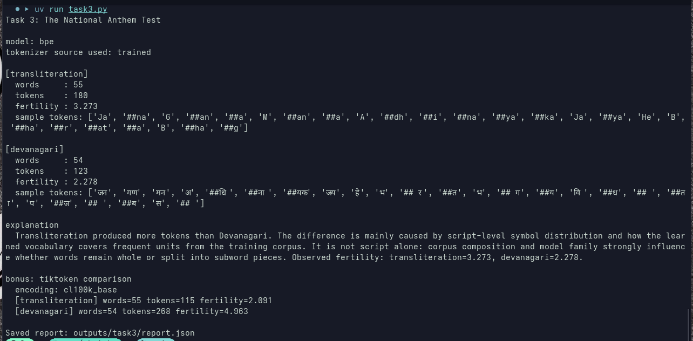

# Augenblick Tasks

**Author:** Trained Models  
**Date:** March 2026

## Introduction

This is the solution file for `TASKS.md`.

## Understanding behind tokenization

Machine learning models and Artificial Intelligence, sophisticated as they might be, are just maths in disguise as per our group's philosophy, or the general truth rather. What we wish to accomplish by stating this, is that the inputs to outputs mappings, are rather "Reals" and not the general textual context.

We define a new term here for further learnings.

**Embeddings:** A representation of a word.

Okay, simple. So what? We understand that words can be assigned some number, in context by providing a map of each word to a specific number or real.

But rather, the general trend that helps us in matter of applications, is another definition that is used in practise where the representation is a real-valued vector that encodes the meaning of the word in such a way that the words that are closer in the vector space are expected to be similar in meaning.

Now, generation of these mappings is rather not that convincingly easy.

Okay you got us, it is Maths again here. We use techniques like neural networks, dimensionality reduction on the word co-occurrence matrix, probabilistic models, explainable knowledge base method, and explicit representation in terms of the context in which words appear.

Reference: [Wikipedia — Word embedding](https://en.wikipedia.org/wiki/Word_embedding)

---

## Understanding of Codebase

### Environment Setup

We observed presence of `pyproject.toml`, so it was pretty easy to run `uv sync`.
It set up all the dependencies properly, and got the CLI working.
Verified via `uv run abctokz --help`.

### Benchmarking

**Bug:** We observed while benchmarking that the results only showed benchmarks for `en` and not `hi`.

**Fix:** We fixed it by changing `eval/benchmark.py`. First, benchmark output was incorrectly reporting only `en` because language was hardcoded to `cfg.languages[0]`.
So we added `BenchmarkRunner._build_language_batches()` to benchmark each tokenizer **per language batch** instead of always using only the first language tag. Also changed `BenchmarkRunner.run()` to suit the added language batching.

---

## Task 1

### Studying the Mantra

Now we wanted to trace the full tokenization process for the Sanskrit mantra using the BPE model.
The pipeline has four stages (as mentioned in the task description).

---

## Task 2

### Responsibility mapping (module-wise)

After reading the core modules and their import structure, the responsibilities map as follows:

| Responsibility | Primary file/module(s) | Why this split exists |
|---|---|---|
| Training a tokenizer (learn vocabulary/pieces from corpus) | `src/abctokz/trainers/base.py`, `src/abctokz/trainers/wordlevel_trainer.py`, `src/abctokz/trainers/bpe_trainer.py`, `src/abctokz/trainers/unigram_trainer.py`; orchestrated by `Tokenizer.train()` in `src/abctokz/tokenizer.py` | Learning logic remains model-specific; top-level class only wires preprocessing + delegation |
| Encode new text with trained tokenizer | `Tokenizer.encode()` in `src/abctokz/tokenizer.py`, plus `src/abctokz/models/*`, `src/abctokz/normalizers/*`, `src/abctokz/pretokenizers/*`, `src/abctokz/processors/*` | Pipeline concerns are centralized; each stage is replaceable |
| Save/load tokenizer artifact | `Tokenizer.save()` / `Tokenizer.load()` in `src/abctokz/tokenizer.py`; helpers in `src/abctokz/utils/io.py`, `src/abctokz/vocab/serialization.py` | Artifact lifecycle is centralized to avoid duplicating persistence logic in each model |
| Measure tokenizer quality (fertility, UNK rate, round-trip, etc.) | `src/abctokz/eval/metrics.py`, `src/abctokz/eval/intrinsic.py`, `src/abctokz/eval/benchmark.py`, reports in `src/abctokz/eval/reports.py` | Evaluation stack is decoupled from training/inference modules |
| Compare against external tokenizers (HF, SentencePiece) | `src/abctokz/adapters/hf.py`, `src/abctokz/adapters/sentencepiece.py`, used by benchmark flows | Adapter layer isolates external dependency APIs from core architecture |

### Core base classes and how they work together

The most important abstractions in this project are the base classes. They define the architecture more than any single implementation file:

- **`Model`** (`src/abctokz/models/base.py`)  
  Core responsibility: tokenize one pre-token into `(token, id)` pairs, and support `save()` / `load()`.  
  Implementations: `WordLevelModel`, `BPEModel`, `UnigramModel`.

- **`Trainer`** (`src/abctokz/trainers/base.py`)  
  Core responsibility: learn a trained `Model` from corpus text (iterator of strings).  
  Implementations: `WordLevelTrainer`, `BPETrainer`, `UnigramTrainer`.

- **`Normalizer` base** (`src/abctokz/normalizers/base.py`)  
  Core responsibility: canonicalize raw text before segmentation (Unicode/whitespace/script-safe transforms).

- **`PreTokenizer` base** (`src/abctokz/pretokenizers/base.py`)  
  Core responsibility: split normalized text into pre-token units. The model cannot cross these boundaries.

- **`PostProcessor` base** (`src/abctokz/processors/base.py`)  
  Core responsibility: transform encodings after model tokenization (for example, adding BOS/EOS special tokens).

- **`Decoder` base** (`src/abctokz/decoders/base.py`)  
  Core responsibility: reconstruct readable text from token strings/IDs according to model family behavior.

- **`Tokenizer` / `AugenblickTokenizer`** (`src/abctokz/tokenizer.py`)  
  Core responsibility: orchestrate the entire pipeline and expose public API (`encode`, `decode`, `train`, `save`, `load`).

### Runtime workflow (what actually happens)

**Training flow:**
1. CLI/config builds a `TokenizerConfig`.
2. `Tokenizer.from_config()` builds normalizer + pre-tokenizer + decoder shell.
3. `Tokenizer.train()` builds a trainer via `trainers.build_trainer()`.
4. Corpus lines are normalized and pre-tokenized before trainer consumption.
5. Trainer learns model artifacts (vocab/merges/pieces) and returns a trained `Model`.

**Inference flow (encode/decode):**
1. `encode(text)` applies normalizer.
2. Pre-tokenizer splits into pre-token units.
3. Model tokenizes each pre-token into `(token, id)` pairs.
4. Post-processor optionally injects special tokens.
5. `decode(ids)` maps IDs back to tokens and decoder reconstructs text.

**Evaluation flow:**
1. `BenchmarkRunner` loads tokenizer artifacts and corpus samples.
2. `encode_batch()` produces encodings; `decode()` is used for round-trip checks.
3. `eval.metrics` computes fertility, UNK rate, sequence-length ratio, and throughput summaries.

### How import structure confirms this design

The module imports strongly reflect intended boundaries:

- `tokenizer.py` imports models, trainers, decoders, normalizers, pre-tokenizers, and processors. This indicates it is the **orchestrator** layer.
- `trainers/base.py` imports only the abstract `Model` and iterator types. It avoids CLI and evaluation modules; training abstraction stays focused.
- `eval/metrics.py` is mostly pure functions over `Encoding` data. It avoids trainer/model construction logic.
- `adapters/hf.py` and `adapters/sentencepiece.py` import third-party libraries, but expose the same local encode/decode style interface expected by benchmark code.
- `cli/main.py` composes command groups (`train`, `encode`, `decode`, `inspect`, `benchmark`) but does not implement model math itself.

### One boundary that is especially clean

The cleanest boundary is **Trainer → Model**. The contract in `trainers/base.py` is very clear: train on an iterator of corpus strings and return a trained `Model`. This is satisfying for three reasons:

- extension is straightforward (add new trainer + model, then wire builder),
- training logic is isolated from serving-time encode/decode code,
- deterministic behavior expectations are defined at the right abstraction level.

### One boundary that feels blurry/inconsistent

The blur appears in **artifact reconstruction vs full pipeline abstraction**. The architecture presents tokenizer as a full pipeline (normalizer + pre-tokenizer + model + decoder), but load-time behavior is currently model-centric and can diverge from train-time behavior for some configurations.

**What I would do to improve it:**

- persist full `TokenizerConfig` (not only minimal model metadata),
- reconstruct normalizer/pre-tokenizer/post-processor in `Tokenizer.load()` exactly as done in `Tokenizer.from_config()`,
- add strict regression tests asserting that `encode(text)` before save and after load are identical for the same artifact.

This would make module boundaries fully consistent with the intended architecture and improve reproducibility.

---
## Task 3


---
## Task 14

### The National Anthem Test

For this task, we used the first stanza of **Jana Gana Mana** in two forms:

- English transliteration
- Devanagari script

We trained a tokenizer and encoded both versions using:

```bash
uv run python task3.py
```

Model used in this run: **BPE**  



### Raw results (abctokz)

| Version | Words | Tokens | Fertility (tokens ÷ words) |
|---|---:|---:|---:|
| Transliteration | 55 | 180 | 3.273 |
| Devanagari | 54 | 123 | 2.278 |

Sample tokenization excerpts:

- Transliteration sample tokens:  
  `[Ja, ##na, G, ##an, ##a, M, ##an, ##a, A, ##dh, ##i, ##na, ##ya, ##ka, Ja, ##ya, He, B, ##ha, ##r, ##at, ##a, B, ##ha, ##g]`

- Devanagari sample tokens:  
  `[जन, गण, मन, अ, ##धि, ##ना, ##यक, जय, हे, भ, ##ार, ##त, भ, ##ाग, ##्य, वि, ##ध, ##ा, ##ता, प, ##ंज, ##ा, ##ब, स, ##ि]`

### Interpretation

In this run, **transliteration produced more tokens** than Devanagari (180 vs 123), and therefore had higher fertility (3.273 vs 2.278).

This difference is not caused by script alone. It comes from a combination of:

1. **Script-level symbol patterns** (how character sequences appear and repeat),
2. **Learned vocabulary coverage** of frequent fragments,
3. **Training corpus composition** (which forms and spellings were frequent),
4. **Model family behavior** (BPE merge strategy in this case).

So the outcome is a joint effect of script + data + tokenizer objective.

### Bonus: external tokenizer comparison (`tiktoken`)

The same two texts were tested with `tiktoken` (`cl100k_base`):

| Version | Words | Tokens | Fertility |
|---|---:|---:|---:|
| Transliteration | 55 | 115 | 2.091 |
| Devanagari | 54 | 268 | 4.963 |

### What this reveals

- `abctokz` BPE (trained on the provided corpus) favored Devanagari more than transliteration for this sample.
- `tiktoken` (general-purpose, externally pretrained) produced the opposite pattern: very high token count for Devanagari.

This reveals a key practical point: **fertility is highly tokenizer-dependent**. A domain/script-aware tokenizer trained on relevant data can be much more token-efficient for that script than a generic external tokenizer.

Report saved at: `outputs/task3/report.json`

### How difficult is adding a fourth model?

Adding a fourth model family like WordPiece is feasible with moderate effort.
The codebase already has clear abstractions in `models/base.py` and `trainers/base.py`, so the core algorithm can be added cleanly.
Most work is integration and plumbing across CLI, config, serialization, and tests.

### Files to create from scratch

- `src/abctokz/models/wordpiece.py`  
  Implements the `Model` abstract interface (tokenization, vocab access, save/load behavior).
- `src/abctokz/trainers/wordpiece.py`  
  Implements the `Trainer` abstract interface (fit/train pipeline and artifact generation).

### Files to modify

- `src/abctokz/tokenizer.py`  
  Register the new model family in load/save dispatch so artifacts can be reconstructed correctly.
- CLI training command (under `src/abctokz/cli/`)  
  Add `wordpiece` as a valid model choice and wire trainer creation.
- `src/abctokz/config/schemas.py`  
  Extend model-type schema validation to include the new model family.

### Files likely unchanged

- Normalizers (`src/abctokz/normalizers/*`)
- Pre-tokenizers (`src/abctokz/pretokenizers/*`)
- Most evaluation metric code (`src/abctokz/eval/metrics.py`)

### Tests to add (repo-specific layout)

In this repository, model tests are grouped in one file.
So the correct approach is to **extend** the existing test module, not create a new standalone one.

- Modify `tests/unit/test_models.py`
- Add a new class `TestWordPieceModel`, mirroring patterns used by
  `TestBPEModel`, `TestUnigramModel`, and `TestWordLevelModel`

Recommended minimum test cases:

- known token/wordpiece segmentation
- unknown token fallback behavior
- empty input handling
- vocab size/access checks
- save/load round-trip correctness

### Where architecture helps vs. where it resists

The architecture helps by providing clean abstract base classes for `Model` and `Trainer` along with a modular pipeline design.
However, some family registration is explicit (hardcoded dispatch), so extension is not fully plug-in based.

### Biggest obstacle

The single biggest obstacle is **artifact compatibility and class dispatch**:
as training the model is only half the work, the critical part is ensuring
`Tokenizer.load()` can reconstruct the new model reliably from saved metadata.
If this integration is incomplete, CLI encode/decode and benchmarking will fail even if the model logic itself is correct.

---

## Task 19

### BPE vs Unigram vs WordLevel: what is actually different?

For this task, all three model families were trained on the **same corpus** and with the **same vocabulary size**. To keep the comparison fair, the same five inputs were encoded with all three models, and the outputs were collected into `outputs/task19/report.json`. The helper script used for verification was `task19.py`. One practical detail is worth noting: the script used the in-memory trained tokenizers for final comparison, because the current load path in the library does not fully restore the preprocessing pipeline for `WordLevel`. The script detects this automatically and reports the source used for analysis.

### How it was verified

The experiment was run using:

```bash
uv run python task19.py
```

The five evaluation inputs were:

```text
hello world
internationalization is nontrivial
नमस्ते दुनिया
प्रौद्योगिकीकरण महत्वपूर्ण है
नमस्ते world 2026
```

The discussion below is based directly on the generated token lists, ID sequences, and vocabulary summaries.

### Side-by-side tokenization behavior

- **Easy English: `hello world`**  
  WordLevel returned `[hello, world]`. Unigram also returned `[hello, world]`. BPE instead split the sentence into smaller reusable fragments: `[h, ##el, ##lo, w, ##or, ##ld]`. This is the simplest demonstration that BPE prefers compositional pieces even when whole-word tokens are available.

- **Complex English: `internationalization is nontrivial`**  
  WordLevel kept the input at word level: `[internationalization, is, nontrivial]`. BPE heavily segmented it into many merge-derived pieces such as `[i, ##nt, ##er, ##n, ##a, ##ti, ##on, ...]`. Unigram landed in between with `[inte, rnationalization, is, nontrivial]`. This makes BPE the most fragmentary model and Unigram the most selective subword model in this experiment.

- **Simple Hindi: `नमस्ते दुनिया`**  
  WordLevel produced `[नमस्ते, दुनिया]`, and Unigram also produced `[नमस्ते, दुनिया]`. BPE split the same phrase into `[न, ##मस, ##्, ##ते, द, ##ु, ##नि, ##य, ##ा]`. So in Hindi too, BPE behaves as a genuine subword segmenter rather than a word memorizer.

- **Complex Hindi: `प्रौद्योगिकीकरण महत्वपूर्ण है`**  
  WordLevel and Unigram both kept the three surface words intact: `[प्रौद्योगिकीकरण, महत्वपूर्ण, है]`. BPE decomposed them into a long sequence of subpieces such as `[प, ##्, ##रौ, ##द, ##्य, ##ोग, ... , है]`. This is the clearest example that BPE treats a morphologically rich word as a composition of reusable fragments rather than as a lexical whole.

- **Mixed script: `नमस्ते world 2026`**  
  WordLevel yielded `[नमस्ते, world, 2026]`. Unigram yielded the same. BPE decomposed each span separately into `[न, ##मस, ##्, ##ते, w, ##or, ##ld, 2, ##02, ##6]`. This mixed-script example is useful because it shows that BPE applies the same merge logic across Devanagari, Latin text, and numerals once preprocessing has isolated the boundaries.

### What dominates each vocabulary?

The generated report summarized the vocabularies as follows:

- **WordLevel:** 38 total entries, 37 whole words, 0 subwords, 0 character-like units, 1 special token.
- **BPE:** 200 total entries, 123 subwords, 75 character-like units, 1 whole word, 1 special token.
- **Unigram:** 200 total entries, 106 subwords, 57 character-like units, 36 whole words, 1 special token.

This is the cleanest high-level difference among the three families. WordLevel spends nearly all of its capacity memorizing observed surface forms. BPE spends nearly all of its capacity on reusable fragments. Unigram sits in between: it still prefers a strong subword inventory, but it also preserves many frequent whole words when that improves the probability of the segmentation.

### Which model would I choose?

- **(a) Low-resource language: Unigram**  
  In low-resource settings, the tokenizer must generalize well to unseen forms. WordLevel is weakest here because it depends too much on exact lexical memorization. BPE is better, but Unigram is usually the safer default because it can preserve whole words when useful while still backing off to smaller pieces when data is sparse.

- **(b) Agglutinative or morphologically rich languages such as Hindi or Finnish: Unigram, with BPE as a close second**  
  The complex Hindi example shows why. BPE handles long forms by fragmenting them aggressively, which is useful, but Unigram gives a better balance between keeping frequent long forms intact and decomposing rare forms when necessary.

- **(c) A task requiring consistent token boundaries across languages: WordLevel**  
  If interpretability and stable word boundaries matter most, WordLevel is the best choice. Its outputs are the easiest to inspect and compare across scripts. The trade-off is weaker robustness to unseen words.

### What does each segmentation strategy reveal about its assumptions?

- **WordLevel assumes words are atomic.** If a word exists in the vocabulary, it should remain intact; if it does not, the model has no internal structure to fall back on.
- **BPE assumes frequent adjacent symbol sequences are useful reusable units.** Language is treated as something that can be assembled from common fragments. This makes BPE deterministic and efficient, but also sometimes overly granular.
- **Unigram assumes that the best tokenization is the most probable sequence of pieces.** This is a softer assumption than BPE. Instead of committing to a single merge history, it chooses among candidate segmentations according to learned likelihoods.

### Final intuition

The main lesson from this experiment is that the three models are not just different algorithms; they express different beliefs about language. **WordLevel** believes words should remain words. **BPE** believes reusable fragments are the right building blocks. **Unigram** believes tokenization should be the most probable explanation from a flexible inventory of pieces. In practice, this means WordLevel gives the cleanest boundaries, BPE gives the strongest compositional behavior, and Unigram gives the best overall balance between memorization and generalization.
```
</attachment>
</attachments>
<context>
The current date is March 14, 2026.
Terminals:
Terminal: fish
Last Command: 
Cwd: /home/ayush/abctokz
Exit Code: 0
Terminal: fish
Last Command: 
Cwd: /home/ayush/abctokz
Exit Code: 0
Terminal: fish
Last Command: 
Cwd: /home/ayush/abctokz
Exit Code: 0

</context>
<editorContext>
The user's current file is /home/ayush/abctokz/solution.tex. The current selection is from line 1 to line 366.
</editorContext>
<reminderInstructions>
You are an agent - you must keep going until the user's query is completely resolved, before ending your turn and yielding back to the user. ONLY terminate your turn when you are sure that the problem is solved, or you absolutely cannot continue.
You take action when possible- the user is expecting YOU to take action and go to work for them. Don't ask unnecessary questions about the details if you can simply DO something useful instead.

</reminderInstructions>
<userRequest>
convert this to md file rather
</userRequest>